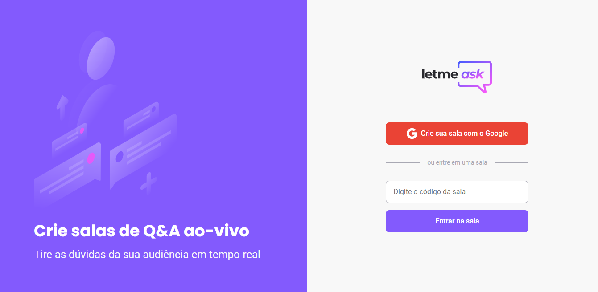

### 🔥 NLW Together - React 

<p align="center">
  
</p>

<h1 align="center">
    
</h1>

<br>

## 🧪 Technologies

This project was developed using the following technologies:

- [React](https://reactjs.org)
- [Firebase](https://firebase.google.com/)
- [TypeScript](https://www.typescriptlang.org/)

## 🚀 Getting started

Clone the project and access the folder. You must have a firebase account for the application to work!

```bash
$ https://github.com/ayslanPurunga/letmeask.git
$ cd letmeask
```

Follow the steps below:
```bash
# Install the dependencies
$ yarn

# Start the project
$ yarn start
```
The application will be available for access on your browser at http://localhost:3000

---

To run the application with deploy: 
```bash
# deploy firebase
$ firebase deploy 
```
The application will be available for access on your browser at https://letmeask-27bfe.web.app/

---

<p align="center">Made with 💜 by Ayslan Fernandes</p>